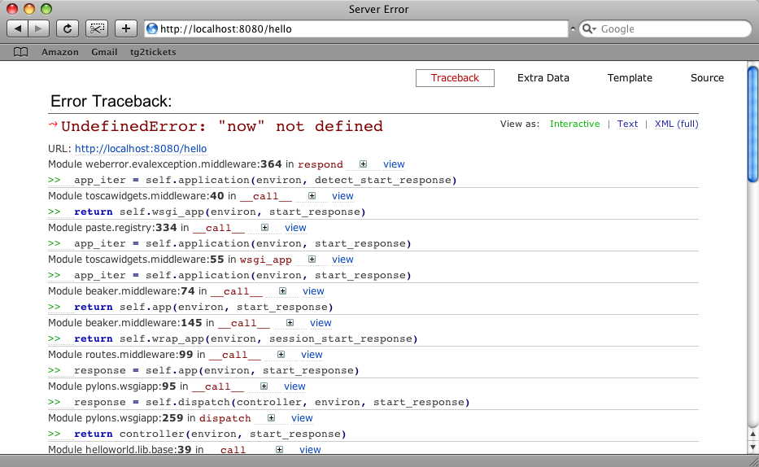

TurboGears 2 at a glance
===========================

:Status: Work in progress

TurboGears 2, like TurboGears 1 and many other modern web frameworks, uses a 
pattern called "Model View Controller", or "MVC" pattern.  Basically the MVC 
pattern is an attempt to separate the code which handles what the user sees 
(the view) from the code that responds to user actions (the controller) and 
code that changes the state of data (the model). 

The goal of the MVC pattern is to help you create more flexible software, 
and since web-applications tend to have more user-interface changes than 
anything else, it's particularly designed so that you can change the `view` 
code without necessarily having to change anything else. 

You have to follow the tutorial `quickstart a project <QuickStart>`_ and serve 
the project first.  If you want to be consistent with the code seen here, call 
your quickstarted project *helloworld*.   If not, you'll just need to update
the imports in the code, because you'll have a different module name.

Then we can play around a little bit with TurboGears 2 and see how it works.

Hello World using template
-------------------------------

Let's take advantage of that fact and make update our view with a Hello World 
headline. 

To keep the tutorial small and simple, we make a assumption that you already 
have some knowledge about html tags.

Edit helloworld/templates/index.html, add a <h1> tag at the top of the body 
like this:

.. code-block:: html

  ...
  <body>
    <h1>Hello World</h1>
    ...
  </body>
  ...

You can now point your browser at http://localhost:8080 to see the change. 
You should see "Hello, world!" text in h1 size.

.. note :: Beware to keep the declare description at the top of template file, they will be used in the default template engine (genshi)::

  <!DOCTYPE html PUBLIC "-//W3C//DTD XHTML 1.0 Transitional//EN" "http://www.w3.org/TR/xhtml1/DTD/xhtml1-transitional.dtd">
  <html xmlns="http://www.w3.org/1999/xhtml" xmlns:py="http://genshi.edgewall.org/" xmlns:xi="http://www.w3.org/2001/XInclude">

Hello World using static file
--------------------------------

Open a new file, edit the content as a simple html file:

.. code-block:: html

    <html xmlns="http://www.w3.org/1999/xhtml" xmlns:py="http://genshi.edgewall.org/" xmlns:xi="http://www.w3.org/2001/XInclude">
      <body>
        <h1>Hello World</h1>
      </body>
    </html>

and save it to helloworld/public/hello.html. You can then just browse to 
http://localhost:8080/hello.html and see the page you made.   In general 
TG2 users are advised to put static html, css, and javascript files in 
the public/static directories provided by the quickstart project.   This 
allows you to later set up a front end server (such as apache, or nginx) to 
serve up those files directly, without requiring any work from your TurboGears 
app. 

Hello World using just the controller
-------------------------------------

The controller defines how the server responds to user actions.   In the case 
of a web framework this almost always means HTTP requests of some kind (
either directly initiated by the user/browser, or as fired off by javascript 
as part of an Ajax app).   

TurboGears 2 uses an *Object Transversal* system to determine what controller 
method will be called for a particular URL.  Basically you have RootController, 
with @exposed objects which define your URL hierarchy. This means that the 
index method of your RootController is called when you go to /index (or even 
just /).  
We can tell our controller to respond at a new URL by defining a new method. 

In this case we will add a new method called hello, which just returns a 
string, which will be returned to the browser directly, without being 
rendered through a template.  

Edit controller/root.py:

.. code-block:: python

  from helloworld.lib.base import BaseController
  from tg import expose

  class RootController(BaseController):

      ### skipped index method goes here!

      @expose()
      def hello(self):
          return "Hello World from the controller"

Browse http://localhost:8080/hello to see the change.

Hello World combines template with controller
-----------------------------------------------

So far we're getting somewhere, we've been returning plaintext for every 
incoming request. But you might have noticed how the default welcome page work. 

We can edit index template, use controllers to define new url's. But let's 
take it one step further and create yet another new URL, plug plug real 
templates into the controllers, and this time rather than returning a string, 
we'll return a dictionary:

.. code-block:: python

  from helloworld.lib.base import BaseController
  from tg import expose

  class RootController(BaseController):

      ### skipped index and hello methods go here!

      @expose('helloworld.templates.index')
      def new_hello(self):
          return dict(hello="Hello World via template replacement")

TurboGears sees that the controller returned a dict, and that there's an 
template name defined in the @expose decorator, and renders that template, 
turning the elements of the dictionary into local variables in the template's 
namespace.

For each page on your site, you could give each of them the corresponding 
template in your controllers. You could specifying the template argument 
with``@expose`` decorator.

That means that we've now got a 'hello' variable in our Genshi template which 
we can use, and we attach the template 'helloworld.templates.index' to 
'new_hello' method. So let's edit helloworld/template/index.html to replace 
the h1 tag we added earlier with:

.. code-block:: html

  <h1 py:replace="hello">hello</h1>

Browse http://localhost:8080 to see the change.

Hello from another controller
_______________________________________

Perhaps we don't want hello world to happen from the root of our site, 
and perhaps we want to make a lot of modifications to the template
that renders our view.  In that case, let's create and publish 
a new controller method, with a new template. 

For now let's just create a new skeleton for our template, by copying 
the default index.html template that was generated when our project
was created.

Let's call the new template hello.html, and put it in the templates
directory with index.html. 

Of course, not every template has dynamic content and therefore 
may not need arguments passed in by the controller. In that case, 
we can just return an empty dictionary, like this:

.. code-block:: python

  @expose(template="helloworld.templates.index")
  def hello(self):
      return dict()

If you browse to http://localhost:8080/hello you'll see the result:

http://localhost:8080 

Oops, we made a mistake!  We're trying to use variables in index.html
which we're not creating in our controller. But, let's take advantage of 
this mistake to take a quick look at the interactive debugger page that 
TG2 gives you when you get a python exception in your code. 

This gives you an opportunity to explore the full stack trace interactively.  
If you click on the little + icon, you can see what local variables are set 
at that frame in the call stack, and you can even use the >>> prompt to type 
in some python code to test what's happening at that level. 

In this case, we can see that there are some issues with an undefined hello 
variable.  Which we just added in the last step.    

That's easy enough to fix let's just return that variable:

.. code-block:: python

  @expose(template="helloworld.templates.index")
  def hello(self):
      return dict(hello='hello')

Hello World using flash
---------------------------

The master template we've defined provides yet another way to get a message to
the next template that's rendered. It automatically looks for a "flash" message
and displays it for you.  

This is particularly useful if you don't know which page will be rendered next
or you just want to let the user know that some action they performed was 
successful. 

It's easy enought to use the flash feature.  Just edit controller/root.py and
change the existing 'flash' statement to::

  flash("Hello World")

Browse http://localhost:8080 to see the change.

Well, that's Hello World.   Hopefully we've given you a quick introduction to 
the TG2 environment, and helped you to understand the MVC archetecture a bit. 

If you have any questions feel free to stop by the IRC channel (#turbogears 
on freenode) or ask questions on the mailing list (urbogears@googlegroups.com).

Feel free to play around a bit, and then feel free to look into the Wiki 20 
tutorial which should help you take your TurboGears skills to the next level. 

